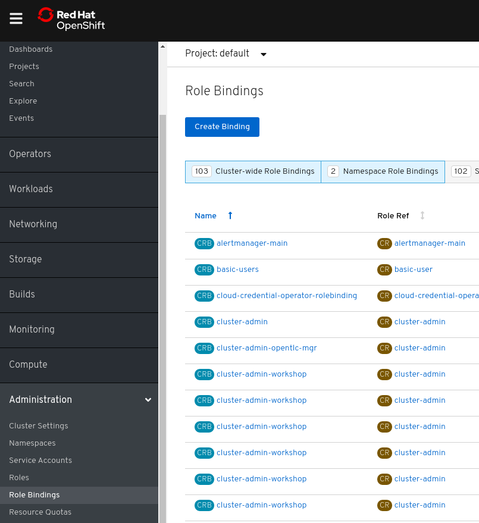

## Permissions and Security

With OpenShift you can manage user rights using Role Based Access Control (RBAC).

In this exercise you will see how to grant and revoke access to users and groups in OpenShift.

[NOTE]
====
<x> and <y> will be given by the workshop supervisor
====

First, login with user<y>.

[source,bash,role="copypaste copypaste-warning"]
----
oc login -u user<y> -p openshift
----

You will receive a output similar to this because user<y> does not have access to any project:

[source,bash]
----
[user1:~] $ oc login -u user51 -p openshift
Login successful.

You don't have any projects. You can try to create a new project, by running

    oc new-project <projectname>
----

With the command below you will grant the user "user<x>" access to the project rbac-test with permissions that is included in the view role.

[source,bash,role="copypaste copypaste-warning"]
----
oc login -u user<x> -p openshift
oc adm policy add-role-to-user view user<y> -n rbac-exercise
----

You will get an output similar to this:

[source,bash]
----
[user1:~] $ oc adm policy add-role-to-user view user51 -n rbac-exercise
clusterrole.rbac.authorization.k8s.io/view added: "user51"
----

Now login with user<y> again and check that he has access to project rbac-exercise:

[source,bash]
----
[user1:~] $ oc login -u user51 -p openshift
Login successful.

You have one project on this server: "rbac-exercise"

Using project "rbac-exercise".
[user1:~] $
----

You can perform this same action using web console by accessing the `Administration` -> `Role Bindings` menu and clicking in the `Create Binding` button.

Now, explore the commands below that you can use to check users permissions:

[source,bash,role="execute"]
----
oc adm policy who-can get clusterrolebinding
oc adm policy who-can get pods -n rbac-exercise
----

Now remove the given role:

[source,bash,role="copypaste copypaste-warning"]
----
oc login -u user<x> -p openshift
oc adm policy remove-role-from-user view user<y> -n rbac-exercise
----

Now run the commands below that user<y> view role has been removed from rbac-exercise project:

[source,bash,role="execute"]
----
oc adm policy who-can get pods -n rbac-exercise
----

## Secret

Secrets is a useful feature to inject sensitive data in a Pod. In this lab you will explore how to inject in a mysql application a secret that holds user and password data.

First, create a new project:

[source,bash,role="execute"]
----
oc new-project mysql-`oc whoami`
----

Create a mysql application using the `mysql-ephemeral` template

[source,bash,role="execute"]
----
oc new-app mysql-ephemeral
----

Now, check that it already uses a secret:

[source,bash,role="execute"]
----
oc set env dc/mysql --list
----

You will see an output similar to this:

[source,bash]
----
oc set env dc/mysql --list
# deploymentconfigs/mysql, container mysql
# MYSQL_USER from secret mysql, key database-user
# MYSQL_PASSWORD from secret mysql, key database-password
# MYSQL_ROOT_PASSWORD from secret mysql, key database-root-password
# MYSQL_DATABASE from secret mysql, key database-name
----

Now let's create a new secret named mysql2 with new credentials:

[source,bash,role="execute"]
----
oc create secret generic mysql2 --from-literal database=workshopdb --from-literal password=workshoppass --from-literal root-password=workshoproot --from-literal user=workshopuser
----

And set mysql deploymentconfig to use this new secret:

[source,bash,role="execute"]
---- 
oc set env --from=secret/mysql2 --prefix=MYSQL_ dc/mysql
----

Let's check again the environments to see the change:

[source,bash,role="execute"]
---- 
oc set env dc/mysql --list
----

You will see an output similar to this:

[source,bash]
---- 
 oc set env dc/mysql --list
# deploymentconfigs/mysql, container mysql
# MYSQL_USER from secret mysql2, key user
# MYSQL_PASSWORD from secret mysql2, key password
# MYSQL_ROOT_PASSWORD from secret mysql2, key root-password
# MYSQL_DATABASE from secret mysql2, key database
----

Now let's check if mysql is using our credentials. Get pod's name and run an rsh to use the mysql cli:

[source,bash,role="execute"]
---- 
oc get pods
----

[source,bash,role="copypaste copypaste-warning"]
----
oc rsh mysql-2-wdlms
----

[source,bash,role="execute"]
---- 
mysql -u workshopuser -pworkshoppass -h $HOSTNAME workshopdb
----

Now we can see that mysql is using the new credentials we created in `mysql2` secret:

[source,bash]
---- 
sh-4.2$ mysql -u workshopuser -pworkshoppass -h $HOSTNAME workshopdb
mysql: [Warning] Using a password on the command line interface can be insecure.
Welcome to the MySQL monitor.  Commands end with ; or \g.
Your MySQL connection id is 14
Server version: 8.0.21 Source distribution

Copyright (c) 2000, 2020, Oracle and/or its affiliates. All rights reserved.

Oracle is a registered trademark of Oracle Corporation and/or its
affiliates. Other names may be trademarks of their respective
owners.

Type 'help;' or '\h' for help. Type '\c' to clear the current input statement.

mysql> 
----

